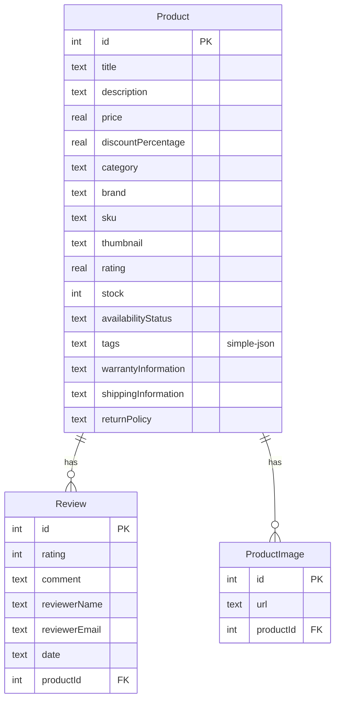

# feat: Add Product Catalog with SQLite and E-Commerce UI

## Overview

Add a full-stack product catalog feature to the workshop app. Seed a SQLite database with 194 products from the DummyJSON API at startup, expose them through NestJS REST endpoints, and display them in an Angular e-commerce UI with a product grid (filterable by category and search) and product detail pages with reviews.

## Problem Statement / Motivation

The workshop app currently has only a todos module with in-memory storage. This feature introduces database persistence (SQLite via TypeORM), external API integration (DummyJSON seed), and a realistic UI pattern (e-commerce product grid). It demonstrates the full data pipeline: external API -> seed -> SQLite -> NestJS API -> Angular.

(see brainstorm: docs/brainstorms/2026-04-13-product-catalog-brainstorm.md)

## Proposed Solution

### Phase 1: Database & Entities (API)

Set up TypeORM with SQLite in the NestJS app. Create `Product`, `Review`, and `ProductImage` entities. Build a seed service that fetches all products from DummyJSON on startup (idempotent — skips if data exists).

### Phase 2: API Endpoints (API)

Create a products module with controller, service, and types. Expose three endpoints for listing, detail, and categories.

### Phase 3: Product Grid Page (Web)

Build an Angular product grid with card components, category filter, search bar, and "Load More" pagination. Filters reflected in URL query params.

### Phase 4: Product Detail Page (Web)

Build a detail page with image gallery, full description, reviews list, pricing, and stock status. Accessible via `/products/:id`.

## Technical Considerations

### New Dependencies

**apps/api:**
- `@nestjs/typeorm` — NestJS TypeORM integration
- `typeorm` — ORM
- `better-sqlite3` — SQLite driver (synchronous, faster than `sqlite3`)
- `@types/better-sqlite3` — dev dependency

**apps/web:**
- No new dependencies

### Architecture

- TypeORM configured with `type: 'better-sqlite3'`, `synchronize: true` (acceptable for workshop)
- Database file at `apps/api/db/workshop.sqlite` (gitignored)
- Reviews and images stored as separate entities with foreign keys to Product (not JSON columns) — enables querying and follows relational best practices
- Seed service uses `OnModuleInit` with count-guard for idempotency
- DummyJSON pagination: fetch all 194 products via `?limit=194` in a single request

### SQLite Gotchas

- No native array columns → use `simple-json` for tags
- No enum columns → use `text` with TypeScript types
- Prices stored as `real` (float) — acceptable for display purposes
- `synchronize: true` cannot drop columns — delete `.sqlite` file to reset during dev

### Entity Relationship Diagram



## Acceptance Criteria

### Phase 1: Database & Entities

- [x] TypeORM configured with SQLite in `apps/api/src/app.module.ts`
- [x] `Product` entity with all fields from data scope (see brainstorm)
- [x] `Review` entity with `@ManyToOne` to Product
- [x] `ProductImage` entity with `@ManyToOne` to Product
- [x] Seed service fetches from `https://dummyjson.com/products?limit=194` on startup
- [x] Seed is idempotent — skips if products already exist
- [x] Seed failure logs a warning and continues (app still starts with empty DB)
- [x] `apps/api/db/` added to `.gitignore`

**Files:**
- `apps/api/src/modules/products/entities/product.entity.ts`
- `apps/api/src/modules/products/entities/review.entity.ts`
- `apps/api/src/modules/products/entities/product-image.entity.ts`
- `apps/api/src/modules/products/seed.service.ts`
- `apps/api/src/modules/products/products.module.ts`

### Phase 2: API Endpoints

- [x] `GET /products` — returns paginated list with `total`, `skip`, `limit` metadata
  - Query params: `?category=`, `?search=`, `?skip=0`, `?limit=20`
  - Search: LIKE query on `title` and `description`
  - Category + search combined: search scoped to selected category
- [x] `GET /products/:id` — returns single product with `reviews` and `images` relations loaded
  - Returns 404 for invalid IDs
- [x] `GET /products/categories` — returns distinct category list

**Files:**
- `apps/api/src/modules/products/products.controller.ts`
- `apps/api/src/modules/products/products.service.ts`
- `apps/api/src/modules/products/product.types.ts`

### Phase 3: Product Grid Page

- [x] `ProductGridComponent` — standalone, lazy-loaded at route `/products`
- [x] `ProductCardComponent` — standalone, receives product via `input()`
- [x] Card displays: thumbnail, title, price (with strikethrough original + discounted price), star rating, category badge
- [x] Category filter dropdown populated from `GET /products/categories`
- [x] Search input with debounce (~300ms)
- [x] Category + search filters combined, reflected in URL query params (`?category=beauty&search=lip`)
- [x] "Load More" button fetches next page (skip increments by limit)
- [x] Loading spinner during fetch
- [x] Empty state when no products match filters
- [x] Responsive CSS Grid: `repeat(auto-fill, minmax(260px, 1fr))`

**Files:**
- `apps/web/src/app/features/products/product-grid.component.ts`
- `apps/web/src/app/features/products/product-card.component.ts`

### Phase 4: Product Detail Page

- [x] `ProductDetailComponent` — standalone, lazy-loaded at route `/products/:id`
- [x] Route param bound via `input()` with `withComponentInputBinding()` in `app.config.ts`
- [x] Image gallery — thumbnail row, click to view larger
- [x] Full description, brand, category, SKU
- [x] Price display with discount calculation (computed from `price` and `discountPercentage`)
- [x] Stock status: "In Stock" (stock > 10), "Low Stock" (1-10), "Out of Stock" (0)
- [x] Reviews list with reviewer name, rating stars, comment, date
- [x] Shipping, warranty, and return policy info
- [x] Back navigation to grid (preserving filters via query params)
- [x] 404 handling for invalid product IDs
- [x] Loading spinner during fetch

**Files:**
- `apps/web/src/app/features/products/product-detail.component.ts`

### Routing Updates

- [x] Add `/products` and `/products/:id` routes to `apps/web/src/app/app.routes.ts`
- [x] Add `withComponentInputBinding()` to `provideRouter` in `apps/web/src/app/app.config.ts`
- [x] Add nav link to products page in app layout

## Implementation Notes

### Conventions to Follow (from repo research)

**API (NestJS):**
- Module structure: `modules/products/` with controller, service, types, entities, seed files
- Register `ProductsModule` in `app.module.ts` imports
- Controller: `@Controller('products')` with constructor-injected service
- Service: `@Injectable()` with `@InjectRepository()` for TypeORM repos
- Types: use `type` aliases (not interfaces), matching `todo.types.ts` pattern

**Web (Angular):**
- Standalone components with inline templates and styles
- Signals for state: `signal<Product[]>([])`, `computed()` for derived state
- New control-flow syntax: `@for (product of products(); track product.id)`, `@if`, `@empty`
- `HttpClient` injected directly in components
- API base URL hardcoded to `http://localhost:3000`
- Lazy-loaded via `loadComponent` in `app.routes.ts`

### Discount Price Calculation

```typescript
// Computed on the frontend from stored price + discountPercentage
const discountedPrice = product.price * (1 - product.discountPercentage / 100);
```

### Seed Data Flow

```
App starts → SeedService.onModuleInit()
  → Check productRepo.count() > 0 → skip
  → Fetch https://dummyjson.com/products?limit=194
  → Map response to Product entities with nested Review[] and ProductImage[]
  → productRepo.save(products) with cascade
```

## Sources & References

### Origin

- **Brainstorm document:** [docs/brainstorms/2026-04-13-product-catalog-brainstorm.md](docs/brainstorms/2026-04-13-product-catalog-brainstorm.md) — Key decisions: TypeORM + SQLite, seed-on-startup, most fields stored, grid + detail pages

### Internal References

- Existing NestJS module pattern: `apps/api/src/modules/todos/`
- Existing Angular component pattern: `apps/web/src/app/features/todos/todos.component.ts`
- Angular routing: `apps/web/src/app/app.routes.ts`
- App config: `apps/web/src/app/app.config.ts`

### External References

- DummyJSON Products API: https://dummyjson.com/products
- TypeORM SQLite docs: https://typeorm.io/
- NestJS TypeORM integration: https://docs.nestjs.com/techniques/database
