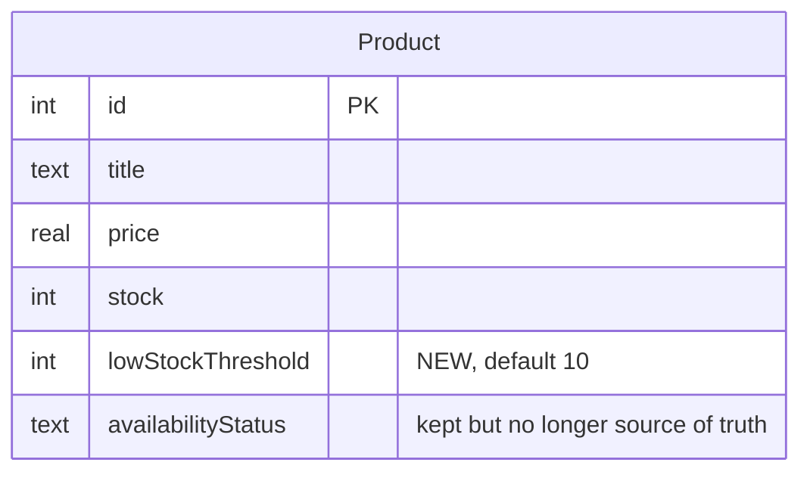

# feat: Add Inventory Management with Admin Pages

## Overview

Extend the existing product catalog with inventory tracking and admin/management pages. Add a `lowStockThreshold` column to the Product entity, auto-compute `availabilityStatus` from `stock` + `lowStockThreshold` on the backend, expose three new admin API endpoints, and build four admin UI pages under `/admin/inventory/*`.

## Problem Statement / Motivation

The product catalog currently stores `stock` and `availabilityStatus` as raw fields. There's no way to mark a product's low-stock threshold, no admin UI for updating inventory, and the availability-status logic is duplicated client-side (hardcoded `stock <= 10` in the detail page). This feature gives admins a real surface for inventory management and centralizes the availability logic on the backend.

(see brainstorm: docs/brainstorms/2026-04-13-inventory-management-brainstorm.md)

## Proposed Solution

### Phase 1: Schema & Availability Logic (API)

Add `lowStockThreshold: number` column to Product (default 10). Update the seed mapping to assign threshold 10 to existing DummyJSON products. Compute `availabilityStatus` on read (in `ProductsService`) from `stock` + `lowStockThreshold` — stop trusting the stored `availabilityStatus` field.

### Phase 2: Admin API Endpoints (API)

Add three endpoints:
- `PATCH /products/:id/inventory` — update stock and/or threshold for one product
- `POST /products/inventory/bulk` — apply set/add/subtract operation across product IDs, per-item results
- Extend `GET /products` with `?lowStock=true` — returns items where `stock <= lowStockThreshold` (includes zero)

### Phase 3: Admin Inventory List Page (Web)

`/admin/inventory` — sortable/filterable table of all products showing thumbnail, title, category, stock, threshold, status. Low-stock rows highlighted. Search and category filter. Checkbox selection for bulk actions.

### Phase 4: Admin Edit + Low-Stock + Bulk Pages (Web)

- `/admin/inventory/:id` — edit form for one product (stock, threshold, derived status preview)
- `/admin/inventory/low-stock` — filtered view of low-stock items, quick-link to edit
- Bulk actions (set/add/subtract) accessible from the inventory list with a bulk-action bar

## Technical Considerations

### Design Decisions (from SpecFlow validation)

| Question | Decision | Rationale |
|----------|----------|-----------|
| Low-stock scope | Include zero (`stock <= threshold`) | One view for admin triage |
| Bulk failure mode | Skip failing items, return per-item results | Clear partial-success feedback |
| Negative stock | Reject (stock >= 0 enforced in service) | Data integrity |
| Concurrent edits | Last-write-wins (no optimistic locking) | Workshop scope |
| Auth on /admin/* | None | Workshop scope |
| Audit trail | Out of scope | YAGNI for workshop |

### Architecture

- Backend owns availability-status logic; frontend only displays. Remove the hardcoded `stock <= 10` threshold in `product-detail.component.ts`.
- `ProductsService` gets a helper `computeAvailability(stock, threshold)` used on every product read.
- Migration path: `synchronize: true` will add the `lowStockThreshold` column with default 10. Existing rows get the default automatically. Delete the `.sqlite` file to force a full re-seed if needed.

### Schema Changes



### API Contracts

**`PATCH /products/:id/inventory`**
```json
// Request
{ "stock"?: number, "lowStockThreshold"?: number }
// Response: updated Product (with derived availabilityStatus)
```

**`POST /products/inventory/bulk`**
```json
// Request
{
  "productIds": [1, 2, 3],
  "operation": "set" | "add" | "subtract",
  "value": 10
}
// Response
{
  "succeeded": [{ "id": 1, "stock": 10 }, ...],
  "failed":    [{ "id": 2, "reason": "would result in negative stock" }, ...]
}
```

**`GET /products?lowStock=true`** — existing endpoint extended; filters to `stock <= lowStockThreshold`.

### Validation Rules

- `stock`: integer, >= 0
- `lowStockThreshold`: integer, >= 0
- Bulk subtract: if `currentStock - value < 0`, item goes to `failed`
- Bulk set with negative value: rejected at request level (400)

## Acceptance Criteria

### Phase 1: Schema & Availability Logic

- [x] Add `lowStockThreshold: number` column to `Product` entity (default 10)
- [x] Seed assigns threshold 10 to all DummyJSON products on fresh seed
- [x] `ProductsService` computes `availabilityStatus` on every read from stock + threshold
  - stock === 0 → 'Out of Stock'
  - stock <= threshold → 'Low Stock'
  - else → 'In Stock'
- [x] Frontend `product-detail.component.ts` uses the server-computed `availabilityStatus` (remove hardcoded `stock <= 10`)

**Files:**
- `apps/api/src/modules/products/entities/product.entity.ts` — add column
- `apps/api/src/modules/products/seed.service.ts` — set default threshold
- `apps/api/src/modules/products/products.service.ts` — `computeAvailability` helper, applied in `findAll` and `findOne`
- `apps/web/src/app/features/products/product-detail.component.ts` — use server-derived status

### Phase 2: Admin API Endpoints

- [x] `PATCH /products/:id/inventory` — validates stock >= 0 and threshold >= 0, returns updated product
- [x] `POST /products/inventory/bulk` — validates operation enum, returns `{ succeeded, failed }` arrays
- [x] Bulk subtract skips items that would go negative (added to `failed` with reason)
- [x] `GET /products?lowStock=true` filters to `stock <= lowStockThreshold` (includes zero)
- [x] All endpoints return 400 for invalid payloads

**Files:**
- `apps/api/src/modules/products/products.controller.ts` — new routes
- `apps/api/src/modules/products/products.service.ts` — `updateInventory`, `bulkAdjust`
- `apps/api/src/modules/products/product.types.ts` — `InventoryUpdateInput`, `BulkAdjustInput`, `BulkAdjustResult`

### Phase 3: Admin Inventory List

- [x] `AdminInventoryListComponent` — standalone, route `/admin/inventory`
- [x] Table: thumbnail, title, category, stock, threshold, status
- [x] Sortable by stock, threshold, title
- [x] Search by title, filter by category
- [x] Low-stock rows visually highlighted (amber/red background)
- [x] Click row → navigate to edit page
- [x] Pagination (load more) consistent with existing product grid
- [x] Checkbox column with bulk-action bar:
  - Bulk-action bar appears when ≥1 row selected
  - Actions: Set Stock, Add to Stock, Subtract from Stock, with value input
  - ~~Confirmation modal before applying~~ (skipped — bar already requires explicit Apply click; toast shows result)
  - Shows toast/banner with success/failure counts after bulk

**Files:**
- `apps/web/src/app/features/admin/inventory-list.component.ts`
- `apps/web/src/app/features/admin/bulk-action-bar.component.ts` (small presentational component)

### Phase 4: Admin Edit + Low-Stock Pages

- [x] `AdminInventoryEditComponent` — route `/admin/inventory/:id`
  - Form fields: stock (number input, min 0), lowStockThreshold (number input, min 0)
  - Shows product thumbnail, title, category for context
  - Derived availability status displayed, updates as form changes
  - Save button → `PATCH /products/:id/inventory`
  - Cancel returns to list (preserving filters)
  - Loading + error states
- [x] `AdminLowStockComponent` — route `/admin/inventory/low-stock`
  - Same table style as inventory list
  - Fetches `GET /products?lowStock=true&limit=100`
  - Empty state when no items are low
  - Quick-edit link per row

**Files:**
- `apps/web/src/app/features/admin/inventory-edit.component.ts`
- `apps/web/src/app/features/admin/low-stock.component.ts`

### Routing & Navigation

- [x] Add `/admin/inventory`, `/admin/inventory/low-stock`, `/admin/inventory/:id` to `app.routes.ts`
- [x] Add "Admin" section in sidebar nav (`app.component.ts`) with links to Inventory and Low Stock

## Implementation Notes

### Conventions to Follow

**API (NestJS):** Follow existing patterns in `modules/products/` — controller/service/types split, `type` aliases not interfaces, `@InjectRepository` for repos, `NotFoundException` for missing IDs.

**Web (Angular):** Standalone components, inline template + styles, signals (`signal`, `computed`), new control-flow syntax (`@for`, `@if`, `@empty`), `HttpClient` injected directly. API base URL `http://localhost:7800`.

### Availability Logic (Single Source of Truth)

```typescript
// apps/api/src/modules/products/products.service.ts
function computeAvailability(stock: number, threshold: number): string {
  if (stock === 0) return 'Out of Stock';
  if (stock <= threshold) return 'Low Stock';
  return 'In Stock';
}
```

Apply this in `findAll` (map each product) and `findOne` before returning. The stored `availabilityStatus` column is effectively deprecated — we can leave it in place without writing to it, or drop it in a follow-up.

### Bulk Adjust Flow

```
Client sends { productIds: [...], operation: 'add', value: 5 }
  → Service loads each product by ID
  → For each: compute newStock, validate >= 0
     → valid: update, push to succeeded
     → invalid: push to failed with reason
  → Return { succeeded, failed }
```

Transaction not required — partial success is the explicit design.

### Frontend Cleanup

The existing `ProductDetailComponent` has hardcoded stock thresholds:

```typescript
// Current (to remove)
if (p.stock <= 10) return `Low Stock (${p.stock} left)`;
```

Replace with the server-provided `availabilityStatus`, keeping the "(N left)" suffix as purely presentational.

## Sources & References

### Origin

- **Brainstorm document:** [docs/brainstorms/2026-04-13-inventory-management-brainstorm.md](docs/brainstorms/2026-04-13-inventory-management-brainstorm.md) — Key decisions carried forward:
  - Extend Product (not separate Inventory entity)
  - Auto-computed availability from stock + threshold
  - Four admin pages, no auth

### Internal References

- Existing Product entity: `apps/api/src/modules/products/entities/product.entity.ts`
- Existing products service: `apps/api/src/modules/products/products.service.ts`
- Product grid pattern: `apps/web/src/app/features/products/product-grid.component.ts`
- Routing: `apps/web/src/app/app.routes.ts`
- Previous plan (for conventions): `docs/plans/2026-04-13-001-feat-product-catalog-plan.md`

### External References

- TypeORM docs (column with default): https://typeorm.io/entities#column-types-for-sqlite-better-sqlite3
