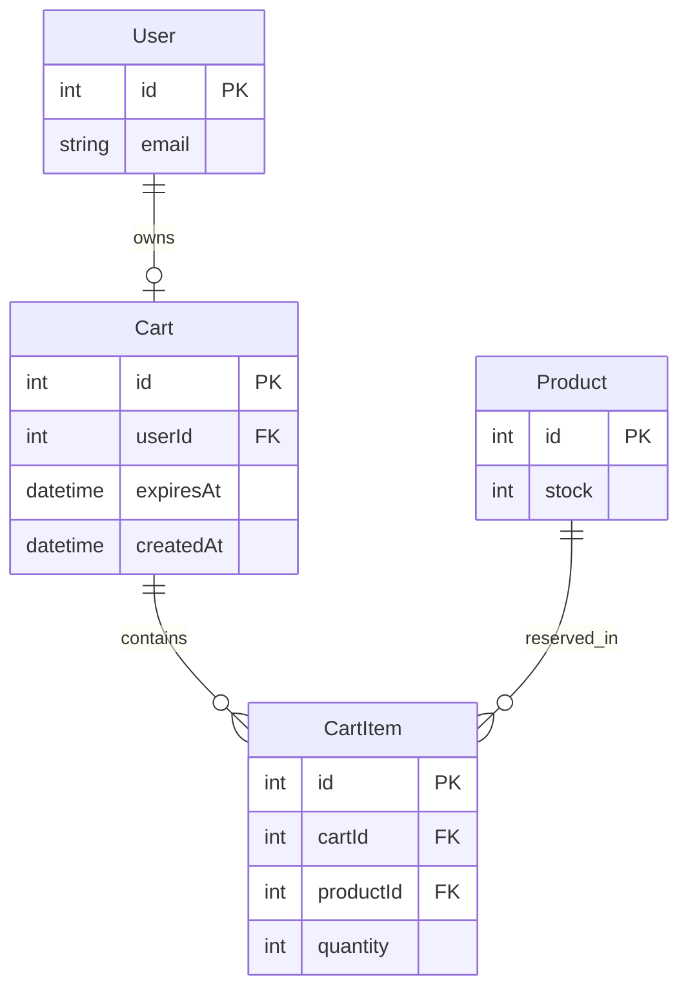

# Shopping Cart with 5-Minute Reservation and Live Inventory

## Description

An authenticated shopper can build a cart of catalog products. The moment the **first** item lands in the cart, a **5-minute fixed-window reservation** begins. For the duration of that window, every unit in the cart counts against the product's publicly-visible available inventory so that other shoppers cannot double-book the same units.

When the 5-minute window elapses, the cart is cleared automatically on the server, the reserved units are released back to available inventory, and the user is notified via a **modal dialog** the next time the app detects the expiry (on action or on a lightweight client timer). Adding or removing items **does not** extend the window — the reservation is a single fixed 5-minute slot that starts at the first add.

Available inventory is displayed on product cards as `stock − all active reservations across users`. The web client keeps its own view fresh by re-fetching the visible product window on every **local** cart mutation (add / remove / quantity change / clear). Cross-user updates are eventually consistent: other shoppers see updated numbers when they next refetch (navigation, Load More, or filter change). No WebSocket / SSE is introduced in this release.

### Out of scope (intentionally)

- Checkout, payment, or order creation (cart only — reservation converts to nothing until a separate checkout spec ships).
- Anonymous / guest carts (authenticated users only, matching the rest of the app).
- Real-time cross-user push (WebSocket / SSE) — eventual consistency via refetch is sufficient.
- Admin tooling for viewing or clearing active reservations.
- Saving carts across the 5-minute window (cart is ephemeral by design).

## Business Objectives

1. **Prevent oversell.** Two shoppers viewing the same low-stock item must not both be able to add the final unit to a cart. "In stock: N" must reflect reality.
2. **Bound inventory hold time.** Hardware and warehouse contracts forbid indefinite reservations. 5 minutes is the agreed SLA between product and operations.
3. **Drive urgency without hostility.** Shoppers get a clear, single-screen signal when their cart expires — no silent data loss, no infinite hold.
4. **Foundation for checkout.** The reservation model in this spec is the contract the future checkout flow will consume; get it right now so downstream work is additive, not a rewrite.
5. **Keep the stack simple.** No new infrastructure (no Redis, no pub/sub). Reservations live in the same SQLite database the rest of the app uses.

## Requirements

### R1 — Cart ownership & lifecycle

- **R1.1** Every authenticated user has **at most one active cart** at any time.
- **R1.2** A cart is "active" while it has ≥ 1 line item **and** `expiresAt` is in the future.
- **R1.3** Adding the first line item to a user's cart sets `expiresAt = now + 5 minutes`. Subsequent mutations **must not** change `expiresAt`.
- **R1.4** When `expiresAt <= now`, the cart is treated as empty by every read path (GET /cart, product availability, UI badge), and its rows are deleted on the next read or by a periodic sweep, whichever happens first.
- **R1.5** Removing the last line item from a cart (explicit empty) deletes the cart and releases its reservations immediately — same effect as expiry but without a notification.

### R2 — Line items

- **R2.1** A line item references exactly one product and carries a positive integer quantity.
- **R2.2** Adding a product that is already in the cart increments its quantity (merge, not duplicate).
- **R2.3** Quantity can be updated to any positive integer; setting it to `0` removes the line.
- **R2.4** The server rejects any mutation that would cause `sum(all active reservations for product) > product.stock`. The rejection is HTTP 409 with a JSON body describing the shortfall.

### R3 — Live inventory

- **R3.1** `GET /products` and `GET /products/:id` must return `availableStock = product.stock − sum(active-reservation quantities for that product)`.
- **R3.2** Expired carts must **not** contribute to reservation totals (even if their rows still exist pending sweep).
- **R3.3** The product card UI displays `availableStock` under the existing "In stock:" label.
- **R3.4** After any successful cart mutation the web client re-fetches the currently-loaded window of products so the UI reflects the new numbers for the current user in the same render frame.

### R4 — Expiry notification

- **R4.1** While a cart is active the web app maintains a single client-side timer that fires at `expiresAt`.
- **R4.2** On timer fire — or on any server response that reports the cart as gone / expired — the app shows a **modal dialog** titled "Your cart expired" with body text explaining that reserved items were released and a single **OK** button that closes the modal.
- **R4.3** The modal is the only UI required for the notification (no toast, no email).
- **R4.4** If the user is not currently on a page in the app when expiry occurs (tab backgrounded), the modal must appear the next time the tab gains focus, not retroactively on a random page.

### R5 — Cart UI entry points

- **R5.1** The existing cart icon in the top-right nav shows a count badge equal to the **sum of line-item quantities** in the user's active cart (or hidden when empty).
- **R5.2** Clicking the cart icon opens a cart drawer (slide-over) listing line items with title, thumbnail, unit price, quantity stepper, line subtotal, remove button.
- **R5.3** The drawer shows a live countdown ("Reserved for 4:32") using the same timer as R4.
- **R5.4** The drawer has a disabled "Checkout" button with helper text "Checkout coming soon" — present but inert so the visual space is stable for the future feature.

### R6 — Authorization

- **R6.1** All cart endpoints require a valid JWT. Unauthenticated callers receive 401.
- **R6.2** A user can only read or mutate their own cart. The server always derives the cart owner from `req.user.id`; it **never** trusts a user id from the request body.
- **R6.3** Admin users have no special cart privileges in this release.

## Technical Requirements

### TR1 — Data model (backend, TypeORM + better-sqlite3)

Two new entities in a new `carts` module at `apps/api/src/modules/carts/`:

```ts
// cart.entity.ts
@Entity()
@Index(['userId'], { unique: true })
export class Cart {
  @PrimaryGeneratedColumn() id!: number;
  @Column({ type: 'int' }) userId!: number;
  @Column({ type: 'datetime' }) expiresAt!: Date;
  @Column({ type: 'datetime' }) createdAt!: Date;
  @OneToMany(() => CartItem, (i) => i.cart, { cascade: true, eager: true }) items!: CartItem[];
}

// cart-item.entity.ts
@Entity()
@Index(['cartId', 'productId'], { unique: true })
export class CartItem {
  @PrimaryGeneratedColumn() id!: number;
  @Column({ type: 'int' }) cartId!: number;
  @Column({ type: 'int' }) productId!: number;
  @Column({ type: 'int' }) quantity!: number;
  @ManyToOne(() => Cart, (c) => c.items, { onDelete: 'CASCADE' }) cart!: Cart;
  @ManyToOne(() => Product) product!: Product;
}
```

Unique index on `Cart.userId` enforces R1.1 at the database level. Unique index on `(cartId, productId)` enforces R2.2 — attempts to insert a duplicate line fall back to an UPDATE.

No new column on `Product`; `availableStock` is computed, not stored.

#### ERD



### TR2 — API surface

All endpoints under `/cart`, all require JWT, all derive user from `req.user.id`.

| Method | Path | Purpose | Notes |
|---|---|---|---|
| `GET` | `/cart` | Current cart for the user | Returns `{ id, expiresAt, items: [{ productId, title, thumbnail, unitPrice, quantity, lineTotal }], subtotal }` or `null` if no active cart. |
| `POST` | `/cart/items` | Add a line item | Body: `{ productId, quantity }`. Creates the cart if none, sets `expiresAt` if creating, merges quantity otherwise. |
| `PATCH` | `/cart/items/:productId` | Update line quantity | Body: `{ quantity }`. Quantity `0` removes the line (and the cart if it becomes empty). |
| `DELETE` | `/cart/items/:productId` | Remove a line | Same effect as PATCH with `quantity: 0`. |
| `DELETE` | `/cart` | Clear entire cart | Deletes the cart row and all items. |

**Response codes**

- `200` on success, `201` on first add that creates a cart.
- `400` for malformed bodies (NestJS `class-validator` pipes).
- `401` for missing/invalid JWT.
- `404` when PATCH/DELETE targets a product id not in the cart.
- `409` for reservation conflict — body: `{ productId, requested, available, message }`.

**Product list impact:** `GET /products` and `GET /products/:id` gain `availableStock: number` in their responses. Computed via a single SQL aggregation joined to active carts (`WHERE expiresAt > now()`), not per-row lookups.

### TR3 — Reservation math

`availableStock(productId) = product.stock − COALESCE(sum(cart_item.quantity) WHERE cart_item.productId = productId AND cart.expiresAt > now(), 0)`.

All reservation-sensitive writes (add, update, checkout later) run inside a **TypeORM transaction** that:

1. Re-reads the product stock and the SUM of active reservations with `SELECT ... FOR UPDATE` semantics — on SQLite, wrap in a `transaction()` with `better-sqlite3`'s implicit serialized writes.
2. Validates the requested delta fits.
3. Inserts / updates the cart item.
4. Commits.

If step 2 fails, the transaction rolls back and the controller throws `ConflictException` (HTTP 409).

### TR4 — Expiry handling

- **Read-path cleanup.** On every `GET /cart` and on every reservation-sensitive write, delete cart rows where `expiresAt <= now()` **before** computing availability. This guarantees stale reservations never inflate the reservation sum (R3.2).
- **No background worker required.** Because every read self-heals, a scheduled sweep is optional. If needed later, a NestJS `@Interval(60_000)` hook can delete expired carts to reclaim row space.
- **Client timer.** The cart drawer / store reads `expiresAt`, schedules a `setTimeout` to fire at that moment, and on fire (a) clears the local cart signal, (b) shows the expiry modal, (c) fires a no-op `GET /cart` which returns `null` and confirms the server agrees.
- **Tab focus recovery (R4.4).** Add a `visibilitychange` listener: when the tab becomes visible, if `expiresAt <= now` and we haven't already shown the modal for this cart id, show it now. A component-local `shownForCartId` prevents re-showing after OK.

### TR5 — Frontend architecture (Angular 18, standalone, signals)

New files under `apps/web/src/app/`:

- `core/cart/cart.service.ts` — injectable singleton. Exposes:
  - `cart = signal<Cart | null>(null)` — full snapshot of the user's active cart.
  - `itemCount = computed(...)` — sum of quantities, for the nav badge.
  - `expiresAt = computed(() => cart()?.expiresAt ?? null)`.
  - `mutationVersion = signal(0)` — incremented after every successful mutation, so the product grid can listen and refetch (R3.4).
  - Methods: `loadCart()`, `addItem(productId, quantity)`, `updateQuantity(productId, quantity)`, `removeItem(productId)`, `clearCart()`, `handleExpiry()`.
- `core/cart/cart-expiry.service.ts` — owns the `setTimeout` and `visibilitychange` listener. Depends on `CartService`. Kept separate so the mutation path isn't tangled with timer bookkeeping (**small, tightly-scoped** per project conventions).
- `core/cart/cart-api.service.ts` — thin HTTP wrapper (mirrors the `ProductsApiService` pattern). Keeps URLs in one place.
- `features/cart/cart-drawer.component.ts` — the slide-over UI; injects `CartService`.
- `features/cart/cart-line.component.ts` — one row (title, thumbnail, stepper, subtotal, remove). Single-responsibility per project conventions.
- `features/cart/cart-countdown.component.ts` — the live "Reserved for m:ss" counter; reads `expiresAt` from `CartService`.
- `features/cart/cart-expired-modal.component.ts` — the R4 modal; shown via a signal toggled by `CartExpiryService`.

The existing `features/products/product-grid.component.ts` gains an **effect** that watches `cartService.mutationVersion()` and refetches the loaded window (same pattern already used for post-cart-mutation inventory refresh — wrap the refetch call in `untracked()` so the effect doesn't re-fire on the product list change, as per recent bug fix).

### TR6 — Routing / nav

- Add a `/cart` route only if the drawer is insufficient — v1 uses the drawer, so no new route is required.
- The nav already has a cart button (see `apps/web/src/app/app.component.ts`); bind its click to `CartDrawerService.open()` and its badge to `CartService.itemCount()`.

### TR7 — Shared conventions

- Follow existing module layout (`module.ts`, `controller.ts`, `service.ts`, `entities/`, `*.types.ts`).
- Error types: throw NestJS `BadRequestException`, `NotFoundException`, `ConflictException`, `UnauthorizedException` — **not** plain errors.
- DTOs validated with `class-validator` decorators.
- Frontend components are **standalone** with `imports: [...]`, use signals + `@for`/`@if`, and the **track** expression is required for every `@for`.
- Keep components small and single-responsibility (per user's global preferences).

### TR8 — Non-functional

- `GET /products` latency regression budget: ≤ +20 ms P95 after adding the reservation aggregation.
- All cart endpoints respond in ≤ 100 ms P95 against seeded data.
- No new external services, no new npm dependencies.

## Test Plan

### TP1 — Backend unit tests (Jest, mirrors `apps/api/src/modules/auth/auth.service.spec.ts`)

- `carts.service.spec.ts`
  - Creates cart + first line item → `expiresAt` is set exactly once, ≈ 5 min in the future.
  - Adding a second distinct line item → does **not** mutate `expiresAt`.
  - Adding an existing product → merges into quantity (single row).
  - Update quantity → updates row; quantity `0` removes row and, if empty, deletes cart.
  - Exceeding availability → throws `ConflictException` with `{ productId, requested, available }`.
  - Reading a cart whose `expiresAt` has passed → returns `null` and deletes rows side-effectually.
  - Concurrency: simulate two sequential adds on the same product that together exceed stock → second throws, first persisted.
- `products.service.spec.ts` additions
  - `availableStock` equals `stock` when no active carts.
  - `availableStock` subtracts active-cart quantities.
  - `availableStock` ignores expired-cart quantities (insert row with `expiresAt = now-1s`).

### TP2 — Backend integration tests (NestJS TestingModule with SQLite in-memory)

- `POST /cart/items` without JWT → 401.
- `POST /cart/items` for product A (qty 1), then again for product A (qty 2) → cart has one line at qty 3.
- `GET /cart` after expiry (advance clock via `jest.useFakeTimers()`) → returns `null`, subsequent `GET /products/:id` shows full stock.
- Two users, one product, stock = 1 — user A adds, user B's add returns 409.

### TP3 — Web unit tests (Karma + Jasmine, mirrors existing `*.spec.ts` patterns)

- `cart.service.spec.ts`
  - `addItem` → calls `cart-api.addItem`, updates `cart` signal, increments `mutationVersion`.
  - Response with `expiresAt` in the past → clears cart signal, triggers `handleExpiry`.
  - `updateQuantity(productId, 0)` → removes the line from the local snapshot.
- `cart-expiry.service.spec.ts`
  - Given `expiresAt = now+100ms`, waits 150ms (fake timers) → `CartExpiryService` calls `CartService.handleExpiry` exactly once.
  - `visibilitychange` with `expiresAt` in the past and `shownForCartId !== cartId` → modal opens; same event again → does not re-open.
- `product-grid.component.spec.ts` addition
  - Regression: bumping `cartService.mutationVersion` triggers exactly **one** refetch (not a loop).

### TP4 — End-to-end (Playwright, using the running dev stack on :7800 / :7801)

- **E2E-1: Happy path** — login, open /products, add product id=1 to cart, assert nav badge shows `1`, open drawer, assert countdown decreases, increment quantity to 2, assert product card shows `availableStock` decremented by 2.
- **E2E-2: Expiry modal** — login, add item, freeze the wall clock via `page.clock.install()` (or set `expiresAt` server-side via test helper), advance 5 min 1 sec, assert modal with title "Your cart expired" is visible and OK dismisses it. After dismissal, nav badge is hidden and product card shows full stock.
- **E2E-3: Oversell guard** — seed product with `stock = 1`, login user A, add to cart, in a second browser context login user B, attempt to add → assert the drawer/card displays the 409 message and the badge does not change for user B.
- **E2E-4: No timer extension** — add item at t=0, add a second distinct item at t=60s, assert the drawer countdown reads ≈ 4:00 (not 5:00) — proves R1.3.
- **E2E-5: Local live inventory** — on the same page, product card shows `availableStock = stock` before add, `stock - 1` immediately after add (single network round-trip, no polling).

### TP5 — Manual smoke checklist (documented in the PR for reviewers)

- [ ] Log out mid-session while cart is active → log back in → cart is still the same (not expired).
- [ ] Hard-refresh the page at `expiresAt - 10s` → timer continues correctly from the server's `expiresAt`.
- [ ] Backgrounded tab for > 5 min → modal appears on refocus exactly once.
- [ ] Remove the last item explicitly → no modal (quiet delete per R1.5), badge hides, product card repaints.

## Sources & References

### Internal

- Product entity (stock column): `apps/api/src/modules/products/entities/product.entity.ts:38-41`
- Existing products service pattern + `findAll`: `apps/api/src/modules/products/products.service.ts`
- JWT auth + `@Public()` guard: `apps/api/src/modules/auth/auth.module.ts`, `apps/api/src/modules/auth/guards/jwt-auth.guard.ts`
- Angular auth core (`AuthService`, token signal, localStorage persistence): `apps/web/src/app/core/auth/auth.service.ts:1-109`
- Route file: `apps/web/src/app/app.routes.ts`
- Effect-tracking pattern + `untracked` learning: `docs/plans/2026-04-14-001-fix-product-load-more-flicker-plan.md`
- Ports & scripts: root `package.json`, `apps/web/angular.json`, `README.md`

### External

- Angular signals and `untracked()`: https://angular.dev/guide/signals
- Angular `@for` track: https://angular.dev/guide/templates/control-flow#track-in-for-blocks
- NestJS transactions with TypeORM: https://docs.nestjs.com/techniques/database#transactions
- TypeORM `@Index` unique constraints: https://typeorm.io/indices
- `better-sqlite3` write serialization (documents SQLite's implicit lock model): https://github.com/WiseLibs/better-sqlite3/blob/master/docs/performance.md

### AI-Era Notes

- Spec generated 2026-04-14 with Claude Opus 4.6. Decisions R1.3 (fixed 5-min window), R3 (client-side recompute via cart mutation), R4.2 (modal UX), R3.1 (stock − all active reservations) were chosen by the user during refinement.
- Any backend endpoints added here must have their Bruno collection reconciled automatically by `bruno-worker` during `/sht:work`.
- Test generation should mirror the existing `auth.service.spec.ts` style for backend and the `ProductsApiService` observable return shape for frontend.
